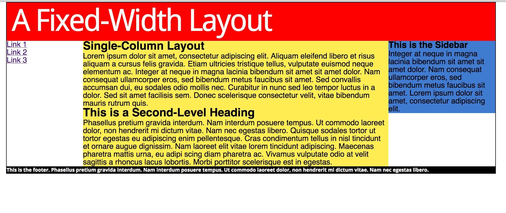
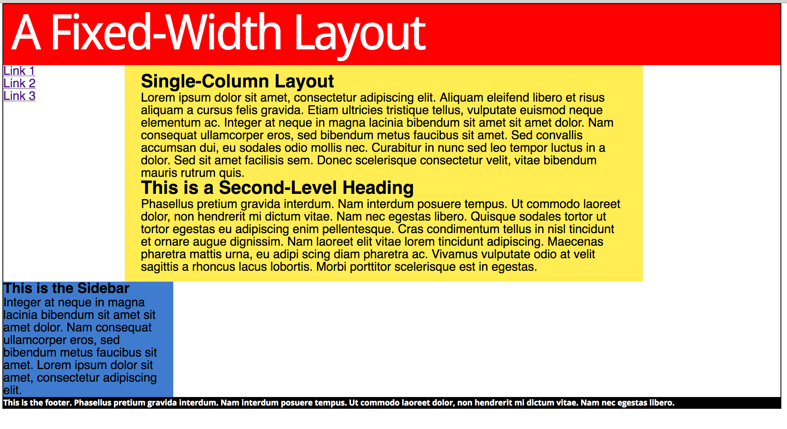
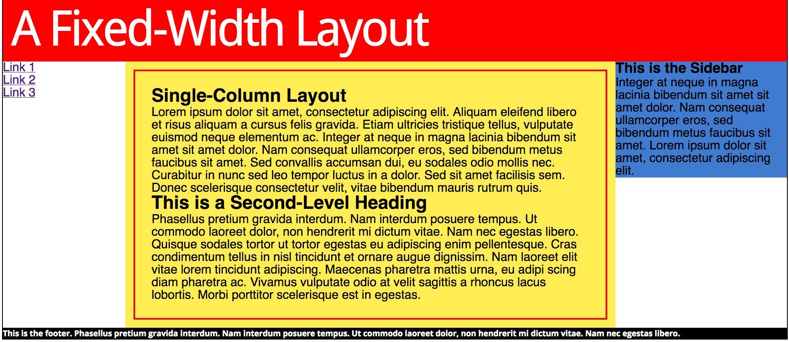
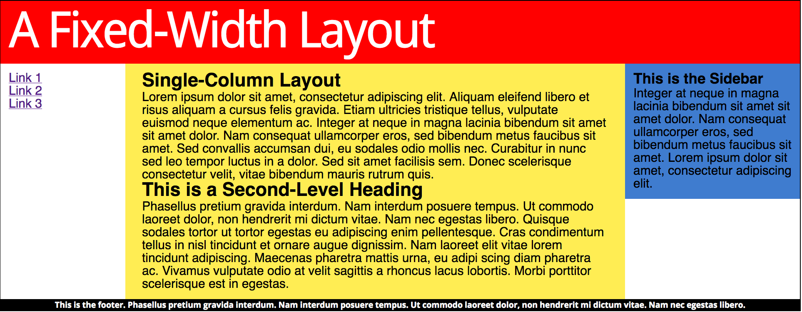
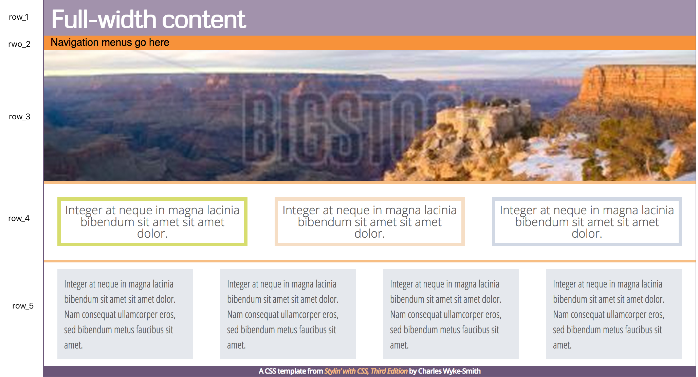

## 页面布局

### 布局的基本概念

多栏布局三种基本的实现方案： 固定宽度、流动、弹性

**固定宽度布局**：

```
大小不会随用户调整浏览器窗口大小而变化，一般是 900 到 1100像素宽。
其中 960 像素是最常见的，因为这个宽度适合所有现代显示器，
而且能够被 16、12、10、8、6、5、4 和 3 整除，
不仅容易计算等宽分栏的数量，而且计算结果也能得到没有小数的像素数。
参考：http://www.960.gs
```

**流动布局**

```
大小会随用户调整浏览器窗口大小而变化。
这种布局能够更好地适应大屏幕，但同时也意味着放弃对页面某些方面的控制，
比如随着页面宽度变化，文本行的长度和页面元素之间的位置关系都可能变化。
Amazon.com 的页面采用的就是流动中栏布局，在各栏宽度加大时通过为内容元素周围添加空白来保持内容居中，
而且现在的导航条会在布局变窄到某个宽度时收缩进一个下拉菜单中，从而为内容腾出空间。

越来越多的浏览器都支持 CSS 媒体查询了。这就让基于浏览器窗口宽度提供不同的 CSS 样式成为可能。
在这种形势下，适应各种屏幕宽度的可变固定布局，正逐步取代流动布局。
这种可变的固定布局能够适应最大和最小的屏幕，业界称之为响应式设计。
```

**弹性布局**：

```
与流动布局类似，在浏览器窗口变宽时，不仅布局变宽，而且所有内容元素的大小也会变化，
让人产生一种所有东西都变大了的感觉。到目前为止，还没有设计得非常好的弹性布局，主要是因为它太过复杂了。
```

#### 布局高度与布局宽度

**布局高度**

```
多数情况下，布局中结构化元素（乃至任何元素）的高度是不必设定的。
事实上，甚至根本不应该给元素设定高度。
除非确实需要这样做，比如在页面中创造一个绝对定位的元素。

为什么正常情况下都应该保持元素 height 属性的默认值 auto 不变呢？
很简单，只有这样元素才能随自己包含内容的增加而在垂直方向上扩展。
这样扩展的元素会把下方的元素向下推，而布局也能随着内容数量的增减而垂直伸缩。
假如你明确设定了元素的高度，那么超出的内容要么被剪掉，
要么会跑到容器之外——取决于元素overflow 属性的设定。
```

**布局宽度**

```
与高度不同，需要更精细地控制布局宽度，以便随着浏览器窗口宽度的合理变化，布局能够作出适当的调整，确保文本行不会过长或过短。
如果随意给元素添加内边距、边框，或者元素本身过大，导致浮动元素的宽度超过包含元素的布局宽度，那浮动元素就可能“躲”到其他元素下方。

即使必须设定栏宽，也不要给包含在其中的内容元素设定宽度，应该让这些内容元素自动扩展到填满栏的宽度。
这是块级元素的默认行为。简言之，就是让栏宽限制其中内容元素的宽度。
```

### 三栏-固定宽度布局

通过把三个浮动容器的总宽度设定为恰好等于外包装的宽度（150 +600 + 210 = 960），就有了三栏布局的框架。

这种办法，可以想加多少栏就加多少栏，只要它们的总宽度等于外包装的宽度即可。

```html
<style>
  * {
    margin: 0;
    padding: 0;
  }

  body {
    font-family: helvetica, arial, sans-serif;
  }

  #wrapper {
    width: 960px;
    margin: 0 auto;
    border: 1px solid;
  }
  article {
    width: 600px;
    float: left;
    background: #ffed53;
  }

  nav {
    width:150px;
    float: left;
  }
  nav li {
    /*去掉列表项目符号*/
    list-style-type:none;
  }
  aside {
    width: 210px;
    float:left;
    background:#3f7ccf;
  }
</style>
<div id="wrapper">

  <nav>
    <!---->
    <ul>
        <li><a href="#">Link 1</a></li>
        <li><a href="#">Link 2</a></li>
        <li><a href="#">Link 3</a></li>
    </ul>
  </nav>
  <article>
    <h1>Single-Column Layout</h1>
    <p>Lorem ipsum ... quis.</p>
    <h2>This is a Second-Level Heading</h2>
    <p>Phasellus pret...egestas.</p>
  </article>
  <aside>
    <h3>This is the Sidebar</h3>
    <p>Integ ... it.</p>

  </aside>
</div>
```

如图:


添加 页头 和 页脚:

```html
<style>
header {
  background: #f00;
}

header h1 {
  font-family: 'Droid Sans';
  font-weight: 400;
  font-size: 4em;
  letter-spacing: -.05em;
  color: #fff;
  padding: 0 0 5px 10px;
}
...
footer {
  background:#000;
  clear: both;
}
footer p {
  font-family: 'Open Sans';
  font-weight: 700;
  font-size: .65em;
  color: #fff;
}
footer a {
  font-family: 'Open Sans';
  font-weight: 700italic;
  font-size: 1em;
  color: #ffed53;
  text-decoration: none;
}
</style>
<div id="wrapper">
  <header>
      <!-- 标题 -->
      <h1>A Fixed-Width Layout</h1>
  </header>
  ...
  <footer>
    <!-- 文本 -->
  </footer>
</div>
```

如图：



**为栏设定内边距和边框**

只要一调整各栏中的内容，布局就可能超过容器宽度，而右边的栏就可能滑到左边的栏下方。

一般来说，两种情况下可能会发生这种问题。

- 为了让内容与栏边界空开距离，为栏添加水平外边距和内边距，或者为了增加栏间距，为栏添加外边距（只要开始给布局添加样式，就一定会采用这里说的一种做法，甚至双管齐下），导致布局宽度增大，进而浮动栏下滑。换句话说，右边浮动的栏因为没有足够的空间与其他栏并列，就会滑到左边栏的下方。

- 在栏中添加大图片，或者没有空格的长字符串（如长 URL），也会导致栏宽超过布局宽度。同样，这种情况下右边的栏也会滑到左边的栏下方。

试试添加内边距，增大内容与栏边界的距离。

```css
article {
 ...
 padding:10px 20px;
}
```

结果:



中间栏中的内容与栏边界之间有了空间，但由于这个栏占据的空间增大，导致右边的栏滑
到了左边的栏下方

3种方法解决这个问题:

- 从设定的元素宽度中减去添加的水平外边距、边框和内边距的宽度和。
  - **重设宽度以抵消内边距和边框**，
  - 但每次只要调整内、外边距就要重设布局宽度，有点烦人。因此这个办法虽然可行，但却不够理想。
- 在容器内部的元素上添加内边距或外边距。
  - 把外边距和内边距应用到内容元素上确实奏效。
    - 前提是这些元素没有明确地设定宽度，这样它们的内容才会随着内、外边距的增加而缩小。
    - 就像盒模型定义所说的，没有宽度的元素在水平方向上会适应其父元素，其内容会随着外边距、边框和内边距的增加而减少。
  - 然而，一栏之中可能会包含大量不同内容的元素。
    - 假如将来又决定调整内容与容器边界的距离，就必须每个元素都要进行调整，这样不仅麻烦，而且容易出错。
    - 况且，给栏添加边框同样会增大栏宽，不可能通过为其包含的内容元素逐个应用样式来做到。
  - 所以说，与其为容器中的元素添加外边距，不如在栏中再添加一个没有宽度的 div，让它包含所有内容元素，然后再给这个 div 应用边框和内边距。
  - 如此一来，只要为内部 div 设定一次样式，就可以把让所有内容元素与栏边界保持一致的距离。
  - 而且，将来再需要调整时也会很方便。任何新增内容元素的宽度都由这个内部 div 决定。
  - 采用这种方法除了标记中多了一个 div 元素外，唯一的问题就是那些反对把标记用于表现用途的纯粹论者会跟你叫嚣。
  - 关于对这个问题的看法，参考附注栏“[关于表现性标记的思考](#关于表现性标记的思考)”，另外一个附注栏“[子-星选择符](#子-星选择符)”也给出了用代码替换内部div 的方案。
- 使用 CSS3 的 box-sizing 属性切换盒子缩放方式，比如 section {box-sizing:border-box;}。
应用 box-sizing 属性后，给 section 添加边框和内边距都不会增大盒子，相反会导致内容变窄。

<span id="关于表现性标记的思考"></span>

**关于表现性标记的思考**

```
HTML 的目的是语义，也就是给内容赋予含义。
而 CSS 呢，是为了把表现性的样式分离出来才发明的。
不过，有些表现性标记是有害的，而有些则没有副作用。
使用表格来创建多栏布局，或者使用<br />标签在段间换行，却不使用<p>标签，这种做法的确不值得提倡，因为这会造成内容难以移植。
比如说: 用三个表格单元作为三栏，这种布局到哪都会显示成表格，就算是在完全不合适的智能手机里也一样。
如果表现性标记无法用 CSS 修改，或者在 CSS 不可用时也要迫使用户接受，那就是滥用 HTML。
可是，div 或 span 这种中性的元素，对默认样式没有影响，除非你给它们应用样式，否则它们就跟不存在一样。
所以，添加这种元素达到表现性的目的是完全可以接受的。
```

用内部div修复上面的问题（改变内边距等会影响布局）

```html
<style>
article .inner{
  margin: 10px;
  border: 2px solid red;
  padding: 20px;
}
/*记得把article的内边距去掉。*/
</style>
<article>
 <div class="inner">
 <!-- 文本 -->
 </div>
</article>
```



给没有宽度的内部 div 应用外边距、边框和内边距后，中间栏的宽度没有变化，右边的栏仍然还在原来的位置上

**结论:** 如果布局中的栏是浮动的，而且都设定了宽度，就根本不要去动它！要动，就把内容放在内部 div 里，动这个 div。

接下来去掉中间栏的外边距、边框和内边距，给其他两栏也添加内部 div，然后只给这三栏加上内边距。

```html
<style>
/*利用这个 div 为三个栏中的内容创造间距 并 居中页脚中的内容*/
nav .inner {padding:10px;}
article .inner {padding:10px 20px;}
aside .inner {padding:10px;}
footer {text-align:center}
</style>
<div id="wrapper">
 <header>
   <!-- header text -->
 </header>
 <nav>
   <div class="inner">
     <ul>
      <!-- 链接 -->
     </ul>
   </div>
 </nav>
 <article>
   <div class="inner">
    <!-- 文本 -->
   </div>
 </article>
 <aside>
   <div class="inner">
    <!-- 文本 -->
   </div>
 </aside>
 <footer>
  <!-- 文本 -->
 </footer>
</div>
```



处理栏及其内部 div 的关键在于，浮动栏并设定栏宽，但不给任何内容元素设定宽度。
要让内容元素扩展以填充它们的父元素——内部 div。
这样，只要简单地设定内部 div 的外边距和内边距，就可以让它们以及它们包含的内容与栏边界保持一定距离。

**注意**: 如果容器的上、下边框不可见，内部 div 的上、下外边距会叠加。如果遇到了这个问题，可以只为容器设定垂直内边距。但要小心一点，别一块儿也添加水平内边距。

<span id="子-星选择符"></span>

**子-星选择符**

```
“子-星选择符”就是一个组合选择符，利用它可以不使用内部 div 就能设定一栏中所有元素的外边距。

星号选择符可以选择“所有元素”，故而，在一个选择符后面加个星号，比如 `someSelector *` 就可以选择 someSelector 所代表元素的所有后代元素。
子选择符可以选择“某元素的子元素”，故而，把子选择符放到星号前面，比如 `someSelector > *` 就会只选择 someSelector所代表元素的所有 子元素，而非后代元素。
这正好适用于选择容器内部的所有顶部元素，然后设定它们的外边距。

比如，对于 section 栏，设定 section > * {margin:0 10px;}，就能为栏中所有子元素，不包括其他后代元素，各应用 10 像素的左、右外边距。

使用“子-星选择符”时注意两点。
第一，在为子元素设定垂直外边距时，只能使用 margin-top 和margin-bottom，不能使用简写的 margin，否则会抵消用“子-星选择符”应用给这些元素的水平外边距。
  如果你想进一步缩进某个子元素的内容，就应该给该子元素应用内边距。
第二，“子-星选择符”有潜在性能问题，因为它会导致浏览器遍历整个 DOM 结构去查找所有匹配的元素。
但我也发现这一点性能影响几乎可以忽略不计。假如你的页面真的包含几千上万个元素，那倒确实该考虑用 ySlow 或其他性能度量工具测一测这个选择符的影响。
```

**使用 box-sizing:border-box**

在三个浮动的栏的 CSS 规则中分别加上`box-sizing:border-box` 声明，再给栏添加内边距（和边框）就不会导致盒子的宽度变化了。

```html
<style>
* {margin:0; padding:0;}
#wrapper {width:960px; margin:0 auto; border:1px solid #000;overflow:hidden;}
header {background:#f00;}
nav {
  box-sizing:border-box;  /* 盒子缩放模式 */
  width:150px;
  float:left;
  background:#dcd9c0;
  padding:10px 10px;
}
/*去掉列表项目符号*/
nav li {list-style-type:none;}
article {
  box-sizing:border-box;  /* 盒子缩放模式 */
  width:600px;
  float:left;
  background:#ffed53;
  padding:10px 20px;
}
aside {
  box-sizing:border-box;  /* 盒子缩放模式 */
  width:210px;
  float:left;
  background:#3f7ccf;
  padding:10px 10px;
}
footer {clear:both; background:#000;}
</style>
<div id="wrapper">
 <header>
  <!-- 标题 -->
 </header>
 <nav>
 <ul>
  <!-- 链接 -->
 </ul>
 </nav>
 <article>
  <!-- 文本 -->
 </article>
 <aside>
  <!-- 文本 -->
 </aside>
 <footer>
  <!-- 文本 -->
 </footer>
</div>
```

腻子脚本[borderBoxModel.js ](https://github.com/albertogasparin/borderBoxModel) 使老版本支持盒子缩放属性。

经过作者事件，不仅给浮动的栏，甚至给所有元素都应用这个不同的盒缩放模型都是没有问题的， `* {box-sizing:border-box} ` 这样每个盒子的宽度并不是内容区的宽度，而是一经设定就不可变的真正的盒子宽度

作者关注的web大牛：[Paul Irish](https://www.paulirish.com), 以及关于[box-sizing的文章](https://www.paulirish.com/2012/box-sizing-border-box-ftw/)

**注意:** 预防过大的元素

设计一个将来可能由他人维护的动态网站时，需要考虑得更长远一些。

比如，应该预见到可能出现一些过大的元素。如果将来有一张比浮动栏更宽的图片被放到栏中，就会导致布局变宽，而右边的栏又会滑到下方。
为此，一个简单的预防措施就是添加一条 `.inner img{max-width:100%;}` 声明，以便限制图片的宽度不超过其父元素（在此就是内部 div）。

另一个办法是给每个栏（或者内部 div，如果用了的话）添加 `overflow:hidden` 声明。
这条声明不会缩小图片以适应父元素，而会将它（以及任何过大元素）超出容器边界的部分剪切掉。

动态网站中另一个潜在的问题是换行。HTML 只会在单词间空格的地方换行。
一些长 URL，甚至一些长单词，在栏比较窄的情况下，都会导致栏宽过大。
因此，还应该给所有栏的外包装元素应用 `word-wrap:break-word` 声明，以便所有栏及其内容继承这个设定。

有了这条声明，浏览器会把过长的词断开显示在不同行上。只是 word-wrap 没有定义在哪里断开，因此结果完全是随机的，而且没有连字符。
不过，这条规则只在需要时才会起作用，而且能保护布局不会被长 URL 顶得支离破碎。

建议在每一栏中都用长 URL、大图片，以及包含内容过多的元素测试一下布局，看看这些声明到底会不会起作用，并发现更多需要事先考虑保护措施的其他漏洞。

### 三栏-中栏流动布局

实现中栏流动布局有两种方法

- 一种是在中栏改变大小时使用负外边距定位右栏.
- 另一种是使用 CSS3 让栏容器具有类似表格单元的行为.

负外边距适合比较老的浏览器，而 CSS 的 table 属性则要简单得多。

#### 用负外边距实现

实现三栏布局且让中栏内容区流动（不固定）的核心问题，就是处理右栏的定位，并在中栏内容区大小改变时控制右栏与布局的关系。

Web 开发人员 Ryan Brill 给出的解决方案是控制两个外包装（通过 ID 值为 wrapper）容器的外边距。其中一个外包装包围所有三栏，另一个外包装只包围左栏和中栏。

```html
<div id="main_wrapper">
   <header>
      <!-- 页眉-->
   </header>
   <div id="threecolwrap">/*三栏外包装（包围全部三栏）*/
      <div id="twocolwrap">/*两栏外包装（包围左栏和中栏）*/
        /*左栏*/
        <nav>
          <!-- 导航 -->
        </nav>
        /*中栏*/
        <article>
          <!-- 区块 -->
        </article>
      </div>/*结束两栏外包装（twocolwrap）*/
      /*右栏*/
      <aside>
        <!-- 侧栏 -->
      </aside>
   </div>/*结束三栏外包装（threecolwrap）*/
   <footer>
      <!-- 页脚 -->
   </footer>
</div>

<style>
* {margin:0; padding:0;}
body {font:1em helvetica, arial, sans-serif;}
div#main_wrapper{
 min-width:600px; max-width:1100px;
 /*超过最大宽度时，居中布局*/
 margin:0 auto;
 /*背景图片默认从左上角开始拼接*/
 background:url(images/bg_tile_150pxw.png) repeat-y #eee;
}
header {
 padding:5px 10px;
 background:#3f7ccf;
}
div#threecolwrap {
 /*浮动强制它包围浮动的栏*/
 float:left;
 width:100%;
 /*背景图片右对齐*/
 background:url(images/bg_tile_210pxw.png) top right repeat-y;
}
div#twocolwrap {
  /*浮动强制它包围浮动的栏*/
  float:left;
  width:100%;
  /*把右栏拉到区块外边距腾出的位置上*/
  margin-right:-210px;
}
nav {
  float:left;
  width:150px;
  background:#f00;
  padding:20px 0;
}
/*让子元素与栏边界保持一定距离*/
nav > * {margin:0 10px;}
article {
  width:auto;
  margin-left:150px;
  /*在流动居中的栏右侧腾出空间*/
  margin-right:210px;
  background:#eee;
  padding:20px 0;
}
/*让子元素与栏边界保持一定距离*/
article > * {margin:0 20px;}
aside {
  float:left;
  width:210px;
  background:#ffed53;
  padding:20px 0;
}
/*让子元素与栏边界保持一定距离*/
aside > * {margin:0 10px;}
  footer {
  clear:both;
  width:100%;
  text-align:center;
  background:#000;
}
</style>
```


#### 用CSS3 单元格实现

使用 CSS 让布局形如表格这种方法不会导致固定不变的表格布局，也不会出现难以重新应用样式的问题（比如在手持设备上表现为一栏）。

CSS 可以把一个 HTML 元素的 **display** 属性设定为 `table`、`table-row` 和 `table-cell`。通过这种方法可以模拟相应 HTML 元素的行为。

通过 CSS 把布局中的栏设定为 `table-cell` 有三个好处。

- 单元格（table-cell）不需要浮动就可以并排显示，而且直接为它们应用内边距也不会破坏布局。
- 默认情况下，一行中的所有单元格高度相同，因而也不需要人造的等高栏效果了。
- 任何没有明确设定宽度的栏都是流动的。

**注意：** CSS3 表格行为在 IE7 及更低版本中并没有得到支持，而且也没有稳妥的补救措施。

关键是，甚至都不需要用 div 外包装来扮演 table 和 tr 元素，仅仅是把三栏的display 属性设定为 table-cell 就可以了。
浏览器的排版引擎在碰到没有表行（tr）的一组单元格时，会自动为它们添加表行，
而在表行没有被 table 元素包围时，会自动为表行添加 table。
因此，不需要多写任何标记，只要把每一栏的 display 属性设定为 table-cell，剩下的事儿就可全部交给浏览器负责了。

例如:

```html
<nav><!-- 内容 --></nav>
<article><!-- 内容 --></article>
<aside><!-- 内容 --></aside>
<style>
nav {display:table-cell; width:150px; padding:10px; background:#dcd9c0;}
article {display:table-cell; padding:10px 20px; background:#ffed53;}
aside {display:table-cell; width:210px; padding:10px; background:#3f7ccf;}
</style>
```


这个流动布局使用了 CSS3 的 `display:table-cell`，让每个栏形同单元格一般

这个简单、功能完备的布局对 IE7 和 IE6 可没有任何腻子脚本，甚至连个退
化的后备方案都没有。

**注意**: 这个简单、功能完备的布局对 IE7 和 IE6 可没有任何腻子脚本，甚至连个退化的后备方案都没有。
在这些浏览器中，三栏会上下堆叠在一起。
因此，除非下定决心不再支持老版本的 IE，否则就得使用前面讲过的其他布局技术。
等吧，等到这些浏览器没人用为止。

**小总结**：布局技术

- 使用内部 div 的浮动固定宽度布局技术，它是适合新旧浏览器的一种最安全的技术。(这种技术要求的工作量也最多)
- 使用 boxsizing:border-box 声明（再加上适用于 IE7 和 IE6 的腻子脚本） 则能提供更直观的盒模型，而且不用使用内部 div。
- CSS3 的 `display:table-cell` 方案容易实现又功能完善（想流动就流动，想固定就固定，各栏 同高，而且不需要内部 div）。然而，它只适合 IE7 以上版本的浏览器。

### 多行多栏布局

实践一个更复杂，也更接近实际的页面框架。这个页面的布局可以用作 WordPress 模板或一个公司网站的基础。

前面的布局中只包含一个 article、一个 nav……，因此比较容易选择，只要用标签名即可。
而在创建复杂布局时，一个页面中会出现多个相同的标签，选择的时候就要用上下文选择符来区分它们了。
通过下面的例子，可以告诉你怎么给标记中添加最少的 ID 和类，同时精确地选择任意元素。

如图:



这个布局由六个等宽的行组成，其中第四行有三栏，第五行有四栏。

**布局标记**:

```html
<div id="wrapper">
	<header>
		<h1>Full-width content</h1>
	</header>
	<nav>
		<p>Navigation menus go here</p>
	</nav>
	<section id="branding">
		
	</section>
	<!-- branding 结束 -->
	<section id="feature_area">
		<article>
			<div class="inner">
				<p>Lorem Ipsum text</p>
			</div>
		</article>
		<!-- 省略另外两个 article 元素 -->
	</section>
	<!-- feature_area 结束-->
	<section id="promo_area">
		<article>
			<div class="inner">
				<p>Lorem Ipsum text</p>
			</div>
		</article>
		<!-- 省略另外三个 article 元素 -->
	</section>
	<!-- promo_area 结束-->
	<footer>
		<p>A CSS template from <a href="http://www.stylinwithcss.com"><em>
 		Stylin' with CSS, Third Edition</em></a> by Charles Wyke-Smith</p>
	</footer>
</div>
```

- 等宽的各行，不用设定它们的宽度，让它们自动扩展填充外包装元素即可。
- 各个栏是由浮动元素构成的，为了防止布局变宽导致右边的栏“下滑”，不要给容器添加内边距，而是把水平内边距加到内部 div 上。

#### CSS选择符的实际应用

随着页面变得越来越复杂，相同的 HTML 元素（如 section、article、nav，等等）会出现很多次。为了选择某个元素，必须区分这些相同的标签名。
为此，有些新手会给每个标签都添加一个不同的类名。这种做法是不值得提倡的。
不仅因为类本身就不该这么用（类应该用于标记具有相同特征的元素），
而且这么多类会把标记弄得很乱，让 CSS 也很难看懂。
为了知道每个类代表哪个元素，你必须不断地查看 HTML。

**更好的做法是给标记中每个主要区域的顶级元素添加一个 ID，这也是使用 ID 的正确方式，ID 就是标识页面中唯一元素用的。
然后，这些 ID 就会成为 HTML 标记中的“路标”，放在上下文选择符开头的时候，它们就能起到框定后代元素的作用。**
这就是在标记中保持类和 ID 属性最少的秘诀。
而且，相应的上下文选择符也能清晰地传达出路径信息，让人从 CSS 中一眼就能看出它要选择哪个元素。

**英文中经常用 hook（译为“路标”，也有译为“钩子”的），表示代码中一个唯一的参照点，其他代码通过这个参照点可以与相应的代码交互。**

前面的 HTML 标记。其中的三个 ID 是我精确选择任意元素唯一必要的几个“路标”，即使再给布局中添加一些内容元素，恐怕也用不着更多了，顶多再多几个。

使用方法例如: 一行 ID 为 feature_area 的 section的顶级元素。这个容器中包含三个article 元素，分别作为一栏。

```css
/*每个 article 作为一个浮动栏*/
section#feature_area article {
 float:left;
 width:320px;
 /*对于作为栏的容器，只能添加垂直内边距*/
 padding:10px 0;
 background:#fff;
 border-top:4px solid #f7be84;
}
/*为所有内容盒子添加公共样式*/
section#feature_area article .inner {
 margin:10px 20px;
 padding:5px;
 background:#fff;
 border:5px solid;
}
/*以下三条分别为三个内容盒子设定样式*/
section#feature_area article:nth-child(1) .inner {
 border-color:#d7dd6f;
}
section#feature_area article:nth-child(2) .inner {
 border-color:#f6dec5;
}
section#feature_area article:nth-child(3) .inner {
 border-color:#d1d8e4;
}
```

用 `section#feature_area article` 选择了三个盒子，用一条规则声明了这些元素共有的样式，包括 宽度、内边距、边框等。这样，对这三个盒子只需维护一组声明即可.

然后，通过三条规则分别为三个盒子设定独特的样式。

如 `section#feature_area article:nth-child(2) .inner { border:5px solid #f6dec5;} ` 表示：选择类为 _inner_ 的元素，它必须是父元素中的第二个 _article_，而且这个 _article_ 必须包含在 `ID 为 feature_area` 的 section 元素中，将它的边框设定为淡橙色。

显然，只要顶级元素上有一个 ID，就可以把它作为“路标”，进而选择它的任意后代元素（甚至能够选择将来才会加入其中的内容元素）。

同样重要的是，这样也避免了无意中把样式添加给标记中的其他元素上。

如果在没有别的手段让你选择某个特定元素的情况下，**只在标记中添加一个类或一个 ID**，那么 HTML 就能保持清晰整洁，而 CSS 也将易读易维护。

#### 内部DIV

这个布局也演示了 **内部 div 承担的定位和样式** 这两个角色。

这个布局中的内部 div 不仅 确保了水平内边距不会破坏布局，另外也承担了 一个视觉功能(内容区的彩色边框就是它们的边框)。
它们的父元素 article 在页面中是看不到的，但为了看见， 可以临时给中间的 article 应用一个背景色，如图所示。


只需添加样式：`section#feature_area article:nth-child(2) {background-color: #e97f63;}`

从中间带背景的 article 元素可以看出，这一行中的三个 article 充满了容器元素 section，而且彼此之间亲密无间。

**每一栏中的间距要依靠内部 div** : 这点很重要.

这个例子中的水平间距是由内部div 的左、右外边距生成的，它们把这个 div 压缩了一下，这才使内容远离了父元素article（如果此时直接给 article 元素应用水平内边距的话，一定会破坏布局）。

而每一栏中的垂直间距是由父元素的内边距生成的。为什么要用父元素呢？原因是 **在父元素没有上、下边框的情况下，子元素的上、下外边距会折叠的** 。

### 总结

- 可以用浮动的有宽度的元素，以及利用表格行为来创建多栏布局。
- 如何让固定布局在页面上居中，并让它们在一定范围内可以伸缩。
- 使用内部 div 在浮动元素中生成间距，而又不会改变布局的总宽度。
- 明白了 ID 和类的真正用途，就是不要把它们当成元素的标签，而是要把它们作为上下文中的“路标”。这样，才能让标记中的 ID 和类保持最少。


as
