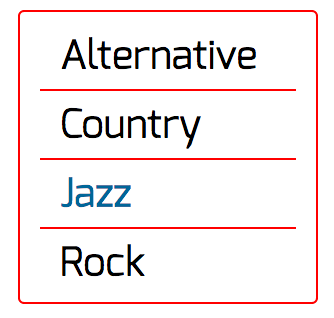

## 界面组建

- [导航菜单](#导航菜单)
  - [纵向菜单](#纵向菜单)
  - [横向菜单](#横向菜单)
  - [下拉菜单](#下拉菜单)
- [表单](#表单)
  - [HTML表单元素](#HTML表单元素)
  - [表单标记策略](#表单标记策略)
  - [设定表单样式](#设定表单样式)
  - [设计搜索表单](#设计搜索表单)
- [弹出层](#弹出层)
  - [堆叠上下文和z-index](#堆叠上下文和zindex)
  - [用CSS创造三角形](#堆叠上下文和)


<span id="导航菜单"></span>

### 导航菜单

菜单由一组链接组成。
用 HTML 中的列表元素（ul 或 ol）来分组链接不仅符合逻辑，而且即使没有额外的 CSS 也能适当显示链接的层次。默认列表项（li）是块级元素，因此它们会上下堆叠。

<span id="纵向菜单"></span>

#### 纵向菜单

**标签**：

```HTML
<nav class="list1">
 <ul>
 <li><a href="#">Alternative</a></li>
 <li><a href="#">Country</a></li>
 <li><a href="#">Jazz</a></li>
 <li><a href="#">Rock</a></li>
 </ul>
</nav>
```

**样式**：

```CSS
/*去掉默认的内边距和外边距*/
* {
  margin: 0;
  padding: 0;
}

/*设定菜单的大小和位置*/
nav {
  margin: 50px;
  width: 150px;
}

/*给菜单加上边框*/
.list1 ul {
  border: 1px solid #f00;
  border-radius: 3px;
  padding: 5px 10px 3px;
}

/*去掉项目符号并为链接添加间距*/
.list1 li {
  list-style-type: none;
  padding: 3px 10px;
}

/*“非首位子元素”选择符 （任何跟在li之后的li） */
.list1 li+li {
  border-top: 1px solid #f00;
}

/*为链接添加样式*/
.list1 a {
  text-decoration: none;
  font: 20px Exo, helvetica, arial, sans-serif;
  font-weight: 400;
  color: #000;
  background: #ffed53;
}

/*悬停高亮*/
.list1 a:hover {
  color: #069;
}
```


**“非首位子元素”选择符** ： 如：`li+li` ， 对于连续的元素，这样，就可以给除第一个 元素 之外的所有元素设定相同的样式。

**同样效果的其他方法** ：

```CSS
/*给所有 li 上方添加一条边框*/
li {
  border-top:1px solid #f00;
}

/*去掉第一个 li 上方的边框*/
li:first-child {
  border-top:none;
}
```

**让列表行可以点击**

目前只有文本是可以点的，因为链接（a）是行内元素，它会收缩并包住其中的文本。然而，更好的用户体验是让列表项所在的整行都能点击。(很多站点都没有这么做)

- 将 `li标签` 的内边距调整到 `a标签`里， 并且 `a标签` 的显示方式调整为 _block_.
- 将 `li标签` 的上边框调整到 `a标签` 中

```CSS
/* 去掉li元素的上边框 */
.list1 li {list-style-type:none;}
/* 调整到a标签的上边框 */
.list1 li + li a {border-top:1px solid #f00;}
/* 调整内边距，显示方式调为 块 显示（让链接完全填满整个列表项） */
.list1 a {display:block; padding:3px 10px;
          text-decoration: none; font:20px Exo, helvetica, arial, sansserif;
          font-weight:400; color:#000; background:#ffed53;}
```

  


<span id="横向菜单"></span>

#### 横向菜单

<span id="下拉菜单"></span>

#### 下拉菜单


<span id="表单"></span>

### 表单

<span id="HTML表单元素"></span>

#### HTML表单元素

<span id="表单标记策略"></span>

#### 表单标记策略

<span id="设定表单样式"></span>

#### 设定表单样式

<span id="设计搜索表单"></span>

#### 设计搜索表单


<span id="弹出层"></span>

### 弹出层

<span id="堆叠上下文和zindex"></span>

#### 堆叠上下文和z-index

<span id="用CSS创造三角形"></span>

#### 用CSS创造三角形
